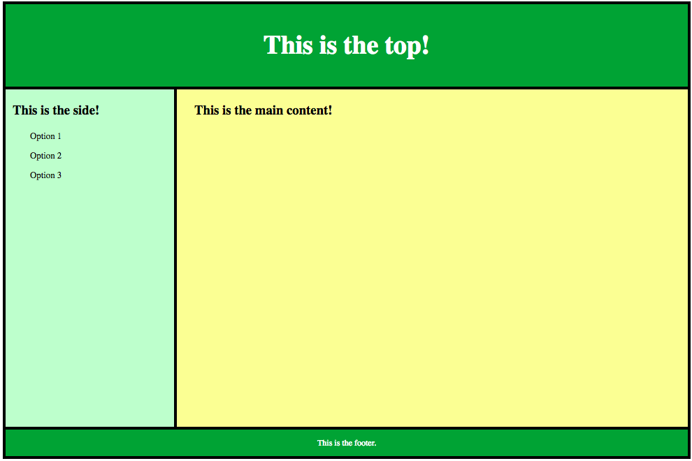

# Mastering CSS Grid! - TO DO

## Goal
Use the grid below as a model of how to structure your `index.html` page.

### CHALLENGE 1
Use CSS grid to style your `index.html` file to have the appropriate topbar, sidebar, main content section, and footer. 

### CHALLENGE 2
Style each section with the appropriate colors, fonts, padding, alignment, etc...

### CHALLENGE 3
Put actual content into your `index.html` page! Use content from Tuesday's To Do (profile for a cartoon character, actor, author, athlete, musician.)